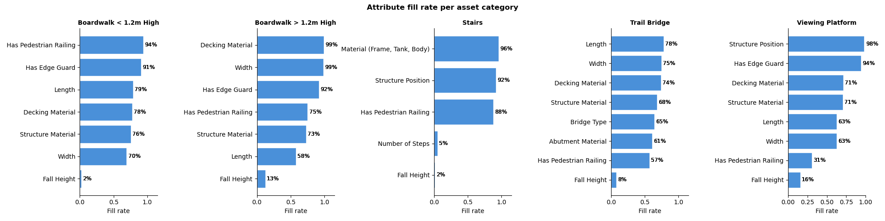
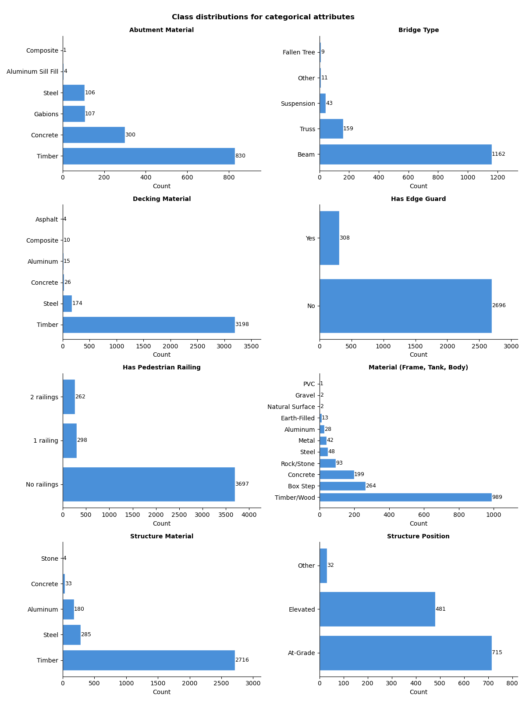
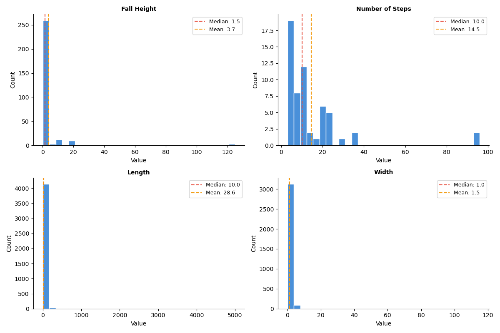

## Summary

This project explores how computer vision can be used to automatically extract infrastructure attributes from park images. The goal is to improve the completeness and reliability of asset management data used by BC Parks.

We aim to predict attributes such as asset type, material, structure position, size ranges, railing presence, and number of steps. Due to weak or incomplete labels, we adopt a staged approach that starts with a zero-shot baseline and progresses toward an attribute-specific modelling pipeline.

## Introduction

BC Parks manages a large inventory of infrastructure assets such as bridges, stairs, boardwalks, and viewing platforms. While many of these assets have associated image data, the attribute information is often incomplete or inconsistent.

Manually reviewing thousands of images to extract attributes such as material, size, and structural features is time-consuming and not scalable. Computer vision techniques provide an opportunity to automate this process and improve data quality.

## Research Question

Can machine learning models automatically predict infrastructure attributes from images, including asset type, material, size ranges, structure position, railing presence, and number of steps?

## Data Sources

The data for this project was exported from the CityWide asset management system using an API key provided by the project partner. It includes two primary components:

1. All image files attached to assets of type `Trail Bridge`, `Stairs`, `Boardwalk` or `Viewing Platform`
2. A CSV file with attribute data for each image file

### Attribute Data

The CSV file with attribute data contains 5,562 rows, where each row corresponds to a single image (attachment) linked to an asset through its Asset ID. As such, the observational unit of the dataset is an individual image–asset pair. Each record also includes metadata such as image path, asset category (`profile_id`), and a series of asset-level attributes (e.g., decking material, fall height, length).

A summary of non-null values, data types, and number of unique values for relevant columns is shown in @tbl-data-summary.

```{python}
#| echo: false
#| label: tbl-data-summary
#| tbl-cap: Summary of non-null counts, data types, and unique values for the attribute dataset.

import pandas as pd

attributes_df = pd.read_csv("../data/raw/citywide/image_attributes_manifest.csv")

attributes_df = attributes_df[[
    "image_path",
    "file_exists", 
    "asset_id", 
    "profile_id",
    "profile_name",
    "description",
    "file_id",
    "filename",
    "attr_Abutment Material",
    "attr_Bridge Type",
    "attr_Decking Material",
    "attr_Fall Height",
    "attr_Has Edge Guard",
    "attr_Has Pedestrian Railing",
    "attr_Length",
    "attr_Material (Frame, Tank, Body)",
    "attr_Number of Steps",
    "attr_Structure Material",
    "attr_Structure Position",
    "attr_Width"
]]

summary = pd.DataFrame({
    "Non-Null Count": attributes_df.notnull().sum(),
    "Null Count": attributes_df.isnull().sum(),
    "Data Type": attributes_df.dtypes,
    "Unique Values Count": attributes_df.nunique()
})
summary.index.name = "Column"

summary
```

The columns `image_path` and `file_id` contain unique values for all rows since each image has a unique path and ID, while `asset_id` only has 3584 unique values which confirms that many assets have more than one attachment. Most of the `attr_` features represent categorical attributes while the attributes fall height and number of steps contain only numerical values. Many attributes have substantial missing data.

### Image Data

In addition to the attribute table, the dataset includes 5,562 image files corresponding to the attachment records. These images were collected by field inspectors and serves as the input for the project's image-analysis workflow. Examples of these images are shown in @fig-examples.

```{python}
#| echo: false
#| label: fig-examples
#| fig-cap: "Sample images from the dataset"

from PIL import Image, ImageOps
import matplotlib.pyplot as plt

img_paths = [
    "../data/raw/citywide/images/253/54322/18912__AST_EX_20210826_112735.jpeg",
    "../data/raw/citywide/images/356/49702/36091__AST_EX_20220216_112215.jpeg",
    "../data/raw/citywide/images/573/128878/91012__AST_IM_20251122_103756.jpeg"
]

fig, axes = plt.subplots(1, 3, figsize=(8, 3))

for ax, img_path in zip(axes, img_paths):
    # Open and auto-orient based on EXIF
    img = Image.open(img_path)
    img = ImageOps.exif_transpose(img)

    ax.imshow(img)
    ax.axis("off")

# Bring images closer together
plt.subplots_adjust(wspace=0.01)

plt.tight_layout()
```


## Data Exploration

Exploratory data analysis (EDA) was conducted on the dataset to answer the following questions about our dataset:
1. How complete is the attribute data across different asset categories?
2. How balanced are categorical attributes across classes?
3. What is the distribution and quality of numerical attributes?
4. What is the variability in image quality across assets?

To answer these questions, the following analyses were performed.

### Unique values and label consistency

To better understand the possible values of categorical attributes, unique values were extracted.

```{python}
#| echo: false
#| label: tbl-unique-vals
#| tbl-cap: "Unique values for categorical attributes"

import pandas as pd

attr_cols = [c for c in attributes_df.columns if c.startswith("attr_")]
num_attrs = ["attr_Fall Height", "attr_Number of Steps", "attr_Length", "attr_Width"]
cat_attrs = [col for col in attr_cols if col not in num_attrs]

unique_table = pd.DataFrame({
    "Column": cat_attrs,
    "Unique Values": [
        ", ".join(map(str, sorted(attributes_df[col].dropna().unique().tolist())))
        for col in cat_attrs
    ]
})

pd.set_option("display.max_colwidth", None)

unique_table
```

@tbl-unique-vals reveals some data quality issues such as the presence of placeholder values like `TBD` to denote missing values. There are also some redundant category labels (e.g., `No` and `No railings`) that should be combined into one category. 

Additionally, it was found that numerical fields contained invalid placeholders such as `-1` or `0`, which also artificially reduce the null counts in @tbl-data-summary.

### Attribute completeness by asset category

To assess data coverage, attribute fill rates were computed for each asset category. This is necessary because not all attributes are relevant to all asset types (e.g., `Number of Steps` is only applicable to stairs). Invalid placeholder values were removed before computing completeness.

{#fig-attribute-fill-rate}

@fig-attribute-fill-rate shows variation in completeness across both attributes and asset types. Numerical attributes such as `Fall Height` and `Number of Steps` are particularly sparse while some categorical attributes like `Decking Material` are more consistently filled. This indicates that attribute collection is inconsistent and may require imputation or alternative learning strategies, including leveraging image-based inference or pre-trained models.

### Categorical attribute distributions

{#fig-cat-distributions}

@fig-cat-distributions shows strong class imbalance across several categorical attributes. For example, for `Decking Material` and `Structure Material`, dominant classes such as `Timber` appear far more frequently than alternatives. This imbalance introduces bias risks for supervised learning, as models may over-predict majority classes and underperform on rare categories. As a result, evaluation metrics such as precision and recall will be more appropriate than overall accuracy. This also motivates the use of a majority-class baseline model for benchmarking.

### Numerical attribute distributions

{#fig-num-distributions}

Numerical attributes were analysed using histograms with mean and median values. These distributions are highly skewed, with clear differences between mean and median, indicating outliers and possibly inconsistent measurement practices.

### Image quality

While having multiple images per asset improves coverage, image quality is highly variable. Some images are close-ups or poorly framed, and may not capture relevant structural information.

As shown in @fig-same-asset, even images from the same asset can vary significantly in usefulness. This suggests that image filtering or weighting may be required during model training to reduce noise from low-quality samples.

```{python}
#| echo: false
#| label: fig-same-asset
#| fig-cap: "Two sample images of the same boardwalk"

img_paths = [
    "../data/raw/citywide/images/573/92846/29443__AST_IM_20211022_155226.jpeg",
    "../data/raw/citywide/images/573/92846/64069__AST_EX_20221114_140509.jpeg"
]

fig, axes = plt.subplots(1, 2, figsize=(8, 3))

for ax, img_path in zip(axes, img_paths):
    img = Image.open(img_path)
    img = ImageOps.exif_transpose(img)

    ax.imshow(img)
    ax.axis("off")

# Remove extra whitespace and push images together
plt.subplots_adjust(wspace=0.02, left=0, right=1, top=1, bottom=0)

plt.show()
```
 

## Proposed Data Science Approach

Our approach is motivated directly by the findings from our exploratory data analysis above. Given the  high degree of class imbalance seen in @fig-cat-distributions, we will start by defining a majority class predictor as our simplest benchmark, which always predicts the most frequent class per attribute. This sets a minimum performance floor: any model that cannot outperform this baseline provides no added value in our pipeline. We’ll be relying on F1 score to get a true picture of our baseline performance. 

As we have seen above in @tbl-unique-vals, not all attributes are the same. They vary in type, difficulty and which asset types they apply to. Categorical attributes will require a classification approach while numerical attributes like length and fall height are better treated as ordered categories due to the difficulty in estimating exact measurements from images without a size reference to work with. Our pipeline therefore routes each image to the relevant set of attribute predictions based on the asset type, which is provided by BCParks via an organized folder structure. See @fig-pipeline.

Given that a large proportion of our attribute labels are missing or incomplete, our next step is to explore zero-shot approaches that require no labelled training data. We will first evaluate a zero-shot Vision Language Model (VLM), building directly on the partner's existing work with VLMs for attribute labelling. Through careful prompt configuration and providing the model with all possible attribute labels, we can establish a strong benchmark without any fine-tuning. Other zero-shot models like CLIP will be used for performance comparison. 

To improve VLM performance, we will also implement a few-shot approach where we provide a small subset of labelled images alongside the prompt, which can improve prediction quality without full training. A key advantage of this approach is its flexibility: the model can also be prompted to return "Cannot Determine" or “Requires Manual Review” when an image does not contain sufficient information, such as close-up or low-quality photos. However, the main challenge with these approaches is that performance depends heavily on prompt and description quality, and they may struggle with fine-grained visual details and recognizing rare attribute values. 

Lastly, we will also explore more advanced methods that make use of our available labelled data as well as some external data that may help support training. This includes training lightweight classifiers on top of rich pre-trained embeddings, which work well even with small datasets and are particularly effective for material-based attributes. As a stretch goal, we will also explore combining visual similarity search with a language model (RAG), where similar labelled images are retrieved and used as context to inform predictions made by a VLM.

All approaches will produce a CSV file with all attribute predictions alongside a confidence score, with low confidence predictions being flagged for manual review by BCParks.

```{mermaid}
%%| label: fig-pipeline
%%| fig-cap: "High-level overview of the proposed attribute prediction pipeline"

flowchart TD
    A["Image Folder per Asset Type"] --> B["Image FilteringYOLO or Model Prompt"]
    B --> C["Attribute Prediction Zero-shot VLM / CLIP"]
    C --> D["CSV OutputPredictions + Confidence Scores"]
    C --> E["Advanced Approaches DINOv2 / RAG"]
    E --> D
```

## Evaluation & Success Criteria

The evaluation plan has two main tasks. First, we will evaluate the relevance filter with F1 score. This shows how well the workflow finds images that are useful for infrastructure review. Second, we will evaluate attribute extraction. We will use macro-F1 for categorical fields, and both mean absolute error (MAE) and root mean squared error (RMSE) for numeric fields. MAE shows the average error size, while RMSE gives more weight to large errors. Using both metrics gives a more complete view of model performance. Final results will be measured on a held-out test set.

For BC Parks, success means the workflow can classify infrastructure photos into the correct asset type and fill key missing attributes, including material, length, width, fall height, railings, and number of steps. The results should be exported as a simple CSV file for staff review. The workflow should support staff decisions, not replace them. It can reduce manual review time, fill missing asset data, and flag uncertain predictions for review.

The main stakeholders are BC Parks staff, the UBC MDS capstone team, and future maintainers. They need accurate data, reproducible methods, and clear documentation for future updates as more data becomes available.

## Timeline 

| Week | Focus | Key Deliverables |
|------|-------|-----------------|
| 1 | Data understanding & preliminary EDA | Completeness analysis, class distribution plots, preliminary EDA notebook, proposal presentation |
| 2 | Data cleaning & preprocessing | More EDA, extract data quality isssues, prepare cleaned master dataset + asset specific datasets, proposal report submitted |
| 3 | Baseline & zero shot models | Train/val/test splits, Majority class predictor, zero-shot VLM and CLIP evaluation, prompt refinement, few-shot VLM |
| 4-5 | Experimenting with Complex Approaches | Embedding (DINOv2) + classifier approach , asset-specific models, RAG pipeline implementation|
| 6–8 | Model evaluation & Fine Tuning, Finalization of data product | Best model fine-tuning, Model evaluation and comparison, final evaluation on held-out test set, final report + data product, partner documentation and demo |

*Note: Data cleaning, preprocessing and transformations will be refined continuously throughout the project as new challenges or changes to modelling approaches emerge.*


