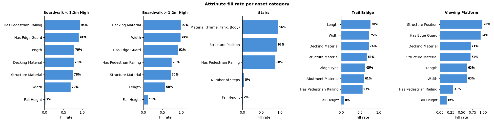
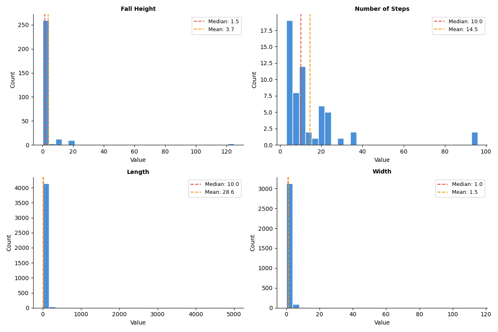
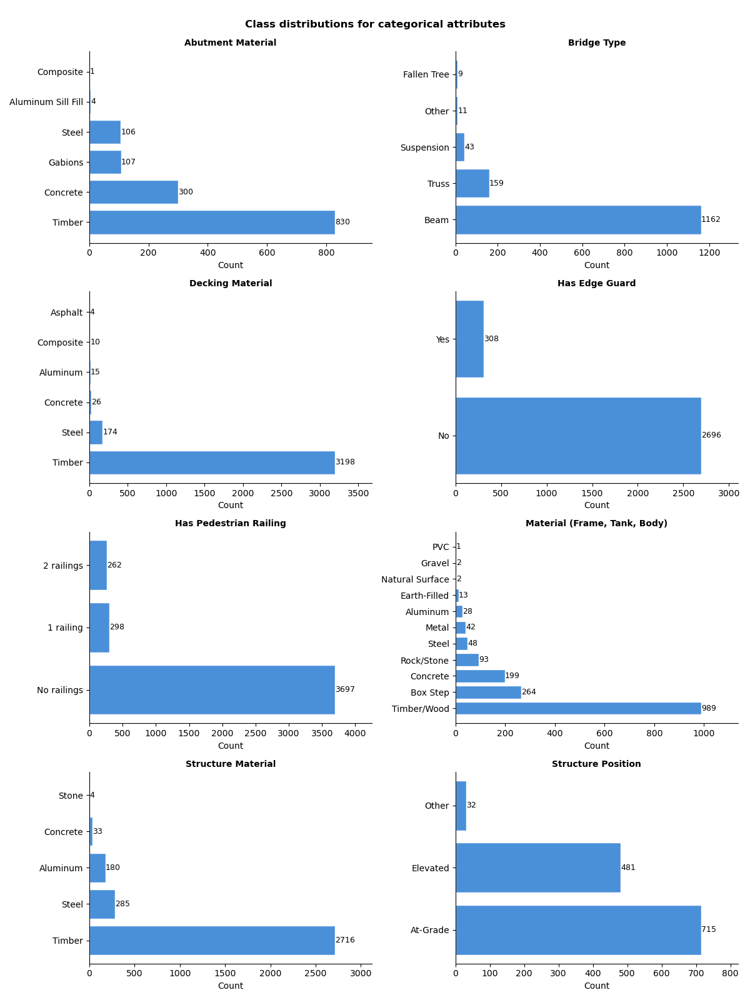

```{python}
#| include: false
import pandas as pd

master_df = pd.read_csv("../data/processed/master_dataset.csv")
file_exists = master_df["file_exists"]
if file_exists.dtype == object:
    image_file_count = int(
        file_exists.astype(str).str.lower().isin(["true", "1", "yes"]).sum()
    )
else:
    image_file_count = int(file_exists.fillna(False).sum())

images_per_asset = master_df.groupby("asset_id")["image_path"].nunique()
data_summary = pd.DataFrame(
    {
        "Measure": [
            "Image-asset rows",
            "Unique assets",
            "Rows with local image files",
            "Assets with more than one image",
            "Mean images per asset",
            "Median images per asset",
            "Maximum images for one asset",
        ],
        "Value": [
            f"{len(master_df):,}",
            f"{master_df['asset_id'].nunique():,}",
            f"{image_file_count:,}",
            f"{int((images_per_asset > 1).sum()):,} ({(images_per_asset > 1).mean():.1%})",
            f"{images_per_asset.mean():.2f}",
            f"{images_per_asset.median():.0f}",
            f"{images_per_asset.max():.0f}",
        ],
    }
)
asset_category_counts = (
    master_df["profile_name"]
    .value_counts()
    .rename_axis("Asset category")
    .reset_index(name="Image-asset rows")
)
asset_category_counts["Image-asset rows"] = asset_category_counts["Image-asset rows"].map(
    lambda value: f"{value:,}"
)

# --- Derived values for inline references in the prose ---
multi_image_assets = int((images_per_asset > 1).sum())
multi_image_share = (images_per_asset > 1).mean()
mean_images = images_per_asset.mean()
median_images = images_per_asset.median()
max_images = int(images_per_asset.max())

fall_height_fill = master_df["fall_height_bin"].notna().mean()
steps_fill = master_df["steps_bin"].notna().mean()
```

# Executive summary

BC Parks manages over 100,000 infrastructure assets, including stairs,
trail bridges, boardwalks, viewing platforms, campsites, and related park
facilities [@parry2026proposal]. Many
asset records contain missing or incomplete attributes, which limits their value
for maintenance planning, inspection prioritization, and replacement cost
estimation. This project developed a reproducible image analysis pipeline that
uses existing asset photographs to predict missing attributes. The default
workflow screens images for privacy sensitive content, groups photos by asset,
extracts DINOv3 image embeddings, and applies lightweight attribute specific
logistic regression classifiers to produce predicted labels with confidence
scores.

On the final held out test set, the default DINOv3 pipeline[@simeoni2025dinov3] achieved a mean
weighted F1 score of 0.83 across 12 evaluated attributes. Performance was
strongest for visually distinctive categorical attributes, including decking
material, structure material, edge guard presence, pedestrian railing presence,
and bridge type, with several scores above 0.90. Attributes related to
measurements were harder because photos often lack a reliable scale reference;
length and width were the weakest targets, reaching 0.66 and 0.63.

The final data product exports prediction tables for partners in both long and
wide formats. Each prediction includes the asset identifier, asset category,
predicted attribute value, confidence score, and confidence level. These
confidence values are intended to help prioritize manual review, but formal
confidence calibration was not completed in this project, so they should
initially be treated as triage guidance rather than definitive risk thresholds.

Overall, the project demonstrates that machine learning from images can improve
the completeness of the BC Parks asset inventory, especially for visual
structural and material attributes. We recommend using the current DINOv3
pipeline[@simeoni2025dinov3] as a decision support tool rather than a fully automated replacement for
field review, with future work focused on confidence calibration, attributes
related to measurements, new asset categories, and CityWide integration.


# Introduction

BC Parks manages over 100,000 infrastructure records across provincial parks,
including stairs, trail bridges, boardwalks, viewing platforms, campsites, and
picnic facilities [@parry2026proposal]. Accurate information about asset
materials, dimensions, and structural features is needed for maintenance
planning, safety inspections, replacement cost estimation, and long-term asset
management. However, many records contain missing attributes, limiting their use
for operational decision making.

Field inspectors already collect photographs during site visits, and
approximately 50,000 asset records include one or more images
[@parry2026proposal]. Recent advances in computer vision and vision language
models create an opportunity to use these existing photographs to enrich the
inventory [@volkov2025imagerecognitionvisionlanguage]. In collaboration with BC
Parks, this project focused on three goals: predicting missing attributes,
providing confidence scores for review, and building a modular workflow that can
be extended to additional asset categories.

The dataset contains images and attribute values for `{python}
f"{master_df['profile_name'].nunique()}"` infrastructure categories: stairs,
trail bridges, low boardwalks, elevated boardwalks, and viewing platforms. We
developed a reproducible pipeline that screens images for privacy sensitive
content, converts cleaned images into embeddings, trains attribute specific
classifiers, and exports predictions with confidence scores for integration into
asset management workflows. This report summarizes the data, modelling
approaches, final test set results, and recommended data product design.


# Data and exploratory data analysis (EDA)

## Data sources and collection

BC Parks provided infrastructure asset records and attached image metadata from the CityWide asset management system. The export covers the asset families explored during this project: trail bridges, stairs, boardwalks, and viewing platforms. The raw data contains three linked components:

- Asset records: including asset identifier and asset category
- Asset attribute records: including materials, structural features, and measurements recorded by field staff
- Image attachment records and downloaded image files

The working dataset is organized around an image-asset attachment row. Each row contains an `asset_id`, image path, CityWide profile, file metadata, and the available attribute values for that asset. For modelling, however, the asset is the prediction unit: multiple images linked to the same asset are grouped together so one asset does not appear in both training and validation folds.

## Size and characteristics

The final processed master dataset contains `{python} f"{len(master_df):,}"` image-asset rows linked to `{python} f"{master_df['asset_id'].nunique():,}"` unique assets. Of these rows, `{python} f"{image_file_count:,}"` have corresponding local image files. The image coverage is uneven by asset type, with most rows belonging to boardwalks (lower than 1.2 meters) and trail bridges.

```{python}
#| label: tbl-data-summary
#| echo: false
#| tbl-cap: "Reproducible summary counts from `data/processed/master_dataset.csv`."
data_summary
```

```{python}
#| label: tbl-asset-category-counts
#| echo: false
#| tbl-cap: "Image-asset rows by CityWide asset category."
asset_category_counts
```

Most assets have a single image, but `{python} f"{multi_image_assets:,}"` assets, or `{python} f"{multi_image_share:.1%}"` of assets, have more than one image. The mean number of images per asset is `{python} f"{mean_images:.2f}"`, the median is `{python} f"{median_images:.0f}"`, and the largest asset has `{python} f"{max_images}"` images. This is useful because multiple viewpoints can reveal different details, but it also makes grouped evaluation essential.

# Data science methods

## Approaches considered

Exploratory analysis showed that this is a missing attribute prediction problem
with three constraints: limited labels for some attributes, strong class
imbalance, and multiple images per asset. We therefore compared two practical
model families. First, we tested zero shot vision language models (VLMs), which
can produce labels without task specific training. Second, we tested pretrained
image embeddings paired with simple classifiers, which can learn BC Parks labels
without training a full image model from scratch.

We evaluated all models at the asset level, with images grouped before
prediction. Majority class, uniform random, and stratified random baselines were
used for comparison. Weighted F1 was the primary metric because it summarizes
precision and recall while reflecting the imbalanced label distribution BC Parks
is most likely to encounter.

## VLM Approach


{#fig-vlm-workflow width=90%}

The VLM path was motivated by the limited labelled data, especially for
measurement based attributes. Rather than predicting exact numeric values, length,
width, fall height, and number of steps were converted into bins, making the
task more realistic from images with inconsistent scale references. The VLM was
given all available images for an asset and asked to return structured labels
and confidence scores.

This approach was useful because it tested whether a model with broad visual and
language knowledge could interpret infrastructure photos without requiring a
large BC Parks training set. It was also a practical comparison point for the
embedding models: if VLMs performed much better on attributes that require
reasoning, such as number of steps or fall height, then the added cost and setup
complexity might be justified for those specific tasks. If performance was
similar, a local embedding model would be more sustainable for processing large
image collections.

{#fig-attribute-fill-rate width=90%}

{#fig-numeric-distributions width=90%}

We compared attribute specific prompts with a single multi attribute prompt, and
tested the two strongest available Google models: `gemma-4-26b` and
`gemini-3-flash-preview`. VLMs are flexible and easy to adapt, but cloud use has
cost, rate limit, and privacy implications. Images were therefore screened and
blurred before any cloud inference, and VLM use was kept optional in the final
pipeline.

The multi attribute prompt was chosen because it reduced the number of model
calls without noticeably reducing weighted F1. This matters operationally:
labelling each asset once is simpler, cheaper, and less exposed to rate limits
than sending one request per attribute. The optional VLM path therefore remains
valuable as an experimentation layer, especially if BC Parks later wants to test
new prompts, new providers, or additional asset categories.

## Embedding-based classification

{#fig-emb-workflow width=90%}

The embedding path used frozen pretrained vision encoders as feature extractors.
Each image was converted into a numeric vector, image vectors were averaged to
one embedding per asset, and one classifier was trained for each target
attribute. This design used all available photos while avoiding leakage across
assets. We compared DINOv3 [@simeoni2025dinov3], SigLIP [@zhai2023sigmoid], and
OpenCLIP/CLIP style embeddings [@radford2021clip], then tested logistic
regression, linear support vector machines, random forests, and gradient
boosting with scikit-learn [@pedregosa2011scikit].

The asset level averaging step was important because the labels describe assets,
not individual images. Treating each image as a separate labelled example would
duplicate the same asset label across multiple photos and could exaggerate model
performance if images of the same asset appeared in both training and testing.
By averaging images first, the model receives one representation per asset while
still benefiting from multiple viewpoints.

## Results & Evaluation

Class imbalance was strongest in the material attributes, where timber often
dominated the labels (@fig-categorical-distributions). This is why weighted F1,
rather than accuracy, was used for model selection.

{#fig-categorical-distributions width=90%}

### Evaluations of VLM

The attribute specific and multi attribute VLM prompts produced similar weighted
F1 scores across stairs, trail bridges, and boardwalks (@fig-stair-vlm-comparison,
@fig-bridge-vlm-comparison, @fig-boardwalk-low-vlm-comparison). Because the multi
attribute prompt labels each asset once instead of once per attribute, it is the
more practical option. Gemma and Gemini also performed similarly overall, with
Gemini occasionally stronger on fall height and Gemma more practical at scale
because of its higher free tier allowance.

{#fig-stair-vlm-comparison width=90%}

{#fig-bridge-vlm-comparison width=90%}

{#fig-boardwalk-low-vlm-comparison width=70%}


### Evaluations of Embedding models

Among classifiers, logistic regression was consistently competitive and
sometimes strongest, especially on binned numeric attributes
(@fig-dinov3-classifiers). This suggested that the embedding space already
separated many attribute classes well enough for a simple linear classifier. A
tuned logistic regression variant did not consistently improve results, so the
default logistic regression setup was retained.

This result also supported a simpler final pipeline. More complex classifiers
did not provide enough improvement to justify extra tuning or reduced
interpretability. Logistic regression is fast to train, easy to rerun when new
labels are added, and produces scores that can be converted into confidence
levels for partner review.

{#fig-dinov3-classifiers width=100%}

With the same logistic regression head, DINOv3, SigLIP, and OpenCLIP had similar
mean weighted F1 across the 12 attributes (@fig-emb-comparison). DINOv3 was
selected as the default because it performed at least as well as the alternatives
on the hardest attributes, runs locally, has no per request cost, and is
lightweight enough for partner use.

The similarity across embedding models was an important finding. It suggests
that the main performance limit was not the choice of encoder alone, but whether
the attribute was visible and consistently labelled in the photographs. This
shifted the final design toward a robust local default model rather than a more
complex ensemble.

{#fig-emb-comparison width=90%} 

{#fig-emb-comparison-per-attribute width=90%} 

### Comparing the two approaches: VLM vs Embeddings

Both approaches performed well on visually distinctive categorical attributes and
less well on measurement attributes, even after binning (@fig-vlm-vs-emb). Since
DINOv3 offered comparable accuracy, local execution, and lower operating cost, it
was chosen as the default. VLM prediction remains available as an optional path
for attributes where BC Parks wants to explore additional model reasoning.

This comparison shaped the final recommendation. DINOv3 is best suited for
routine batch prediction because it can be run locally after the model weights
are downloaded. VLMs are better positioned as a supplementary tool for future
experiments, especially where prompts can encode extra context that is difficult
for an embedding classifier to learn from limited labels.

{#fig-vlm-vs-emb width=100%}

### Evaluation of DINOv3 on the final held-out test dataset

{#fig-test-set-results width=100%}

@fig-test-set-results shows the final DINOv3 pipeline on the held out test set.
The model performed best on visually distinctive categorical attributes:
decking material reached 0.97, structure material, edge guard, structure
position, and pedestrian railing reached 0.92 to 0.93, and bridge type reached
0.86. Abutment material and the stair specific material attribute were lower at
0.72, likely because rare classes had fewer examples.

Measurement attributes remained harder. Fall height and number of steps reached
0.84 and 0.81, but the labelled test samples were small; length and width were
the weakest targets at 0.66 and 0.63. Overall, the key result is that prediction
quality depends most on whether the attribute is visually determinable from the
available photographs.

This distinction is central for deployment. High performing visual attributes
are reasonable candidates for automated data completion with review sampling,
while measurement attributes should be treated as decision support rather than
final labels. For those harder attributes, confidence scores and manual review
remain important safeguards until additional labelled data or methods that
estimate physical scale are available.

# Data product

The primary deliverable is a pipeline that predicts missing BC Parks asset
attributes from photographs and exports tables for partners with predicted
values, confidence scores, and confidence levels. The product is intended to
augment existing asset management workflows rather than replace staff review.

{#fig-data-pipeline width=90%}

The pipeline is modular because each asset category has different attribute
requirements. Trail bridges, stairs, boardwalks, and viewing platforms are routed
to the relevant prediction tasks, and each attribute is modelled independently.
The default implementation uses DINOv3 embeddings with logistic regression
classifiers because it performs well, runs locally, and has low operational cost.
VLM prompts remain available as an optional alternative for future experimentation.

# Conclusions and recommendations

This project shows that existing BC Parks photographs can support automated
attribute prediction, but reliability depends on the attribute. Visually
distinctive categorical attributes such as decking material, structure material,
and pedestrian railing are the strongest candidates for routine automation.
Attributes that require physical scale, such as length, width, fall height, and
number of steps, should continue to receive more manual review.

## Strengths and limitations of current design

The main strength of the design is that it uses pretrained models, making useful
prediction possible despite limited labelled data. The DINOv3 workflow is also
practical for deployment because it is lightweight, runs locally, and avoids the
cost and rate limits of cloud VLM APIs. Confidence scores are included to help
prioritize uncertain or high consequence predictions for human review.

The main limitations are data related. Rare classes, ambiguous labels, and small
test samples make some results less stable. Measurement attributes are also
intrinsically difficult when images lack a scale reference. Confidence scores
should therefore be treated as review guidance until they are calibrated against
future prediction correctness.

## Future product improvements

Future work should prioritize three areas: expanding labelled data for rare
classes, calibrating confidence scores against correctness, and improving
measurement based attributes through additional labels or depth estimation. Once
validated on more data, the modular pipeline can be extended to additional BC
Parks asset categories and integrated into CityWide workflows.

# References
